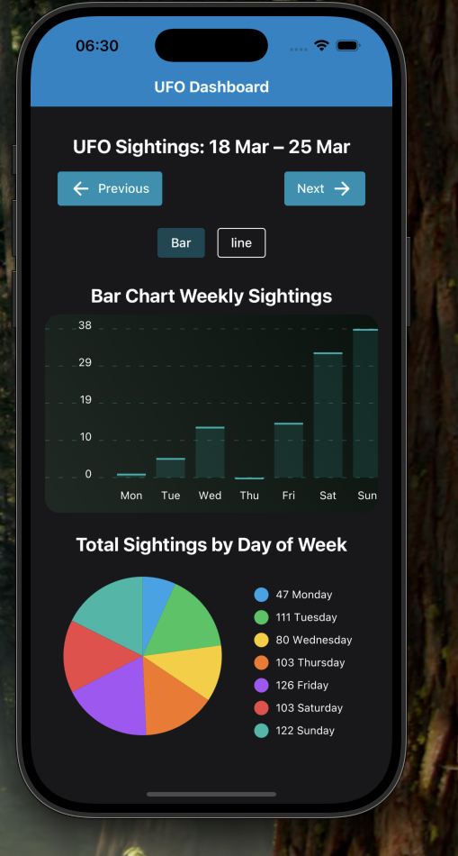
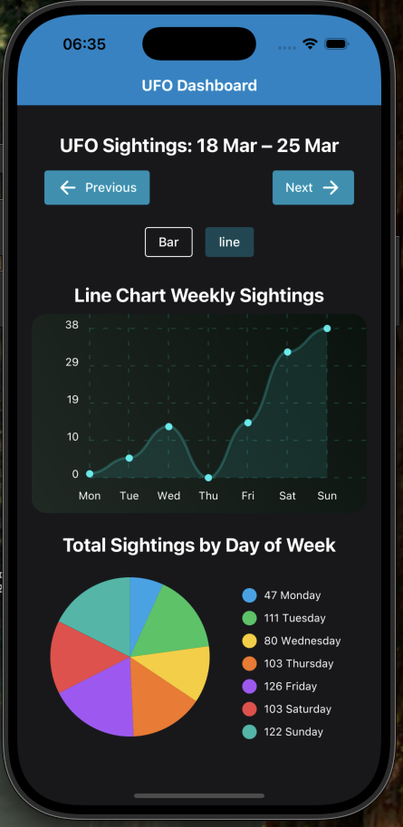
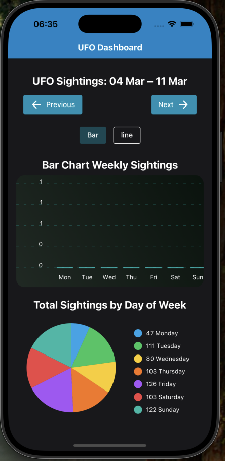
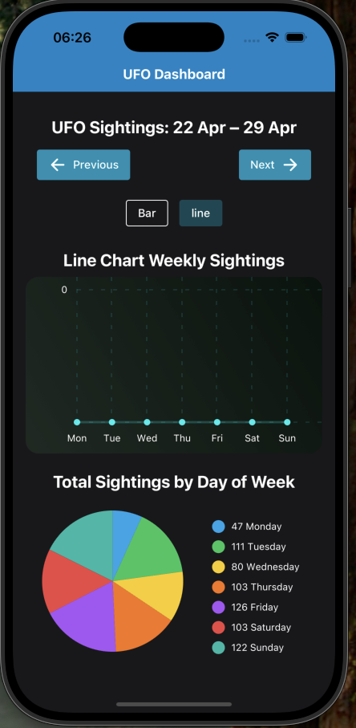

# 👽 UFO Sightings Dashboard

A small mobile dashboard built with **React Native**, **Expo**, and **TypeScript**, to help visualize UFO sightings data using interactive charts. The app includes:

- 📊 Bar, Line, and Pie charts (react-native-chart-kit)
- 🎨 Theme support via a custom ThemeProvider
- 🌍 Future Multilingual support via LangProvider
- ⚡ Skeleton loaders for chart placeholders
- 🧠 Flat structure for rapid development
---

## 📦 Tech Stack

- **Expo** (React Native)
- **TypeScript**
- **Tailwind via NativeWind**
- **react-native-chart-kit**
- **date-fns** (date parsing/grouping)
- **Context API** (`ThemeProvider`, `LangProvider`)
- **Axios** (for API calls)
---

## Decisions worth Mentioning

1. The application uses a flat component structure for fast simplified  development. The choice was made due to the create of a few components and a primary index(Used as Dashboard Screen).
   - This keeps the navigation simple to use. 

2. Single test file 
    - Due to a few tests files being created, the singular test file helps for example purposes.

3. Index.ts files within components, hooks, providers is used to simple and standardize imports.

----

## Considerations for large applications not included in this application
1. The use of a more modular component structure would work great.
    - As the app grows, each component will move into its own folder for better separation of concerns.
   
   For Example:
     ```
      ├── TestComponent/ 
             ├── testComponent.tsx 
             ├── testComponent.styles.tsx   
             ├── testComponent.spec.tsx   
      ``` 
  2. Organising the applications based of features and not just components 
      - Organizing the app by feature (e.g., sightings, user, settings) will make it easier to scale and maintain in the long run.    
  3. Including services folder for seperation of  api services 
      - A dedicated services/directory is best to be introduced to centralize API calls. This helps to separate data fetching logic from UI concerns. It also allows for easier testing and mocking of network requests.
  4. Crash Analytics
      - Helps monitor and track app crashes in real time, making it easier to identify and fix issues quickly.
  5. Tracking event
      - Intergrating event tracking to monitor user interactions


---
 
 ## Performance Considerations
 1. Skeleton loaders 
      -  Used to minimize layout shift during data fetching.
 2. Chart "conditioning"  
      - Charts are shown only when active, which helps keep the app fast and responsive.  


---

## Get started

1. Install dependencies

   ```bash
   yarn install
   ```

2. Start the app

   ```bash
   npx expo start
   ```

---
## Testing
- **Jest** 
- **@testing-library/react-native** 

You can run tests using:

```bash
yarn test
 ```

In the output, you'll find options to open the app in a

- [development build](https://docs.expo.dev/develop/development-builds/introduction/)
- [Android emulator](https://docs.expo.dev/workflow/android-studio-emulator/)
- [iOS simulator](https://docs.expo.dev/workflow/ios-simulator/)
- [Expo Go](https://expo.dev/go), a limited sandbox for trying out app development with Expo


---
## Learn more

To learn more about developing your project with Expo, look at the following resources:

- [Expo documentation](https://docs.expo.dev/): Learn fundamentals, or go into advanced topics with our [guides](https://docs.expo.dev/guides).
- [Learn Expo tutorial](https://docs.expo.dev/tutorial/introduction/): Follow a step-by-step tutorial where you'll create a project that runs on Android, iOS, and the web.

---
## 🏗️ Project Structure
```
UFO-SIGHTINGS/
├── app/                         # Entry routes and layout for the app
│   ├── _layout.tsx              # Expo Router layout (includes providers)
│   ├── [...404].tsx             # Not found page(Useful for PWA purposes)
│   └── index.tsx                # Dashboard screen (entry route)
│
├── assets/                      # Static assets (images, fonts, etc.) - Not really used for the application
│
├── components/                  # Reusable UI components
│   ├── tests/                   # Component unit tests
│   │   └── PreviousNext.test.tsx
│   ├── AppLayout.tsx
│   ├── ChartsUI.tsx
│   ├── ChartSwitcher.tsx
│   ├── ChartToggle.tsx
│   ├── ErrorUI.tsx
│   ├── headingText.tsx
|   ├──index.tsx
│   ├── LoadingUI.tsx
│   ├── PieChartSection.tsx
│   ├── PreviousNext.tsx
│   ├── SkeletonCartToggle.tsx
│   └── SkeletonChart.tsx
│
├── core/                        # Core logic and shared architecture
│   ├── hooks/                   # Reusable logic using React hooks
|.  |   ├──index.tsx
│   │   ├── tests/
│   │   │   └── useUfoSightings.test.ts
│   │   ├── useShimmerAnimation.ts
│   │   └── useUfoSightings.ts
│   │
│   ├── providers/               # Global state/context providers
│   │   ├── tests/
│   │   │   ├── LangProvider.test.tsx
│   │   │   └── ThemeProvider.test.tsx
│   │   ├── LangProvider.tsx
│   │   └── ThemeProvider.tsx
│   │
│   ├── texts/                   # Centralized text for UI(Simple purpose updates)
│   │   ├── chartTitles.ts
│   │   └── screenTitles.ts
│   │
│   ├── types/                   # Type aliases (Can be shared across app)
│   │   ├── ChartProps.ts
│   │   ├── ChartViewType.ts
│   │   └── SupportedLang.ts
│   │
│   └── utilities/               # Pure utility/helper functions
│       ├── tests/
│       │   └── dateUtils.test.ts
│       └── dateUtils.ts
│
├── node_modules/                # Project dependencies (auto-managed)
├── scripts/                     # Optional scripts folder (currently empty)
├── .gitignore
├── .watchmanconfig
├── app.json
├── babel.config.js
├── eslint.config.js
├── expo-env.d.ts
├── global.css
├── metro.config.js
├── nativewind-env.d.ts
├── package.json
├── package-lock.json
├── tailwind.config.js
├── tsconfig.json
├── yarn.lock
```
## Screenshots




